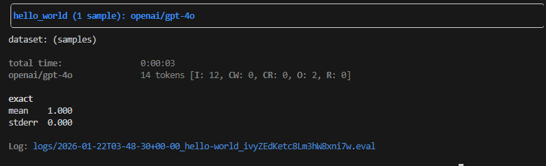
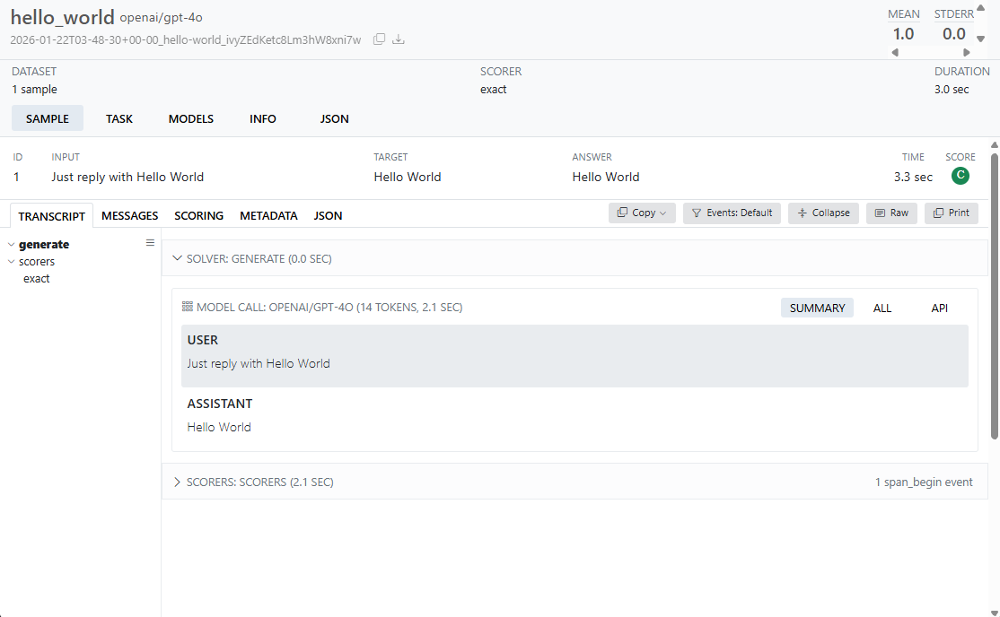
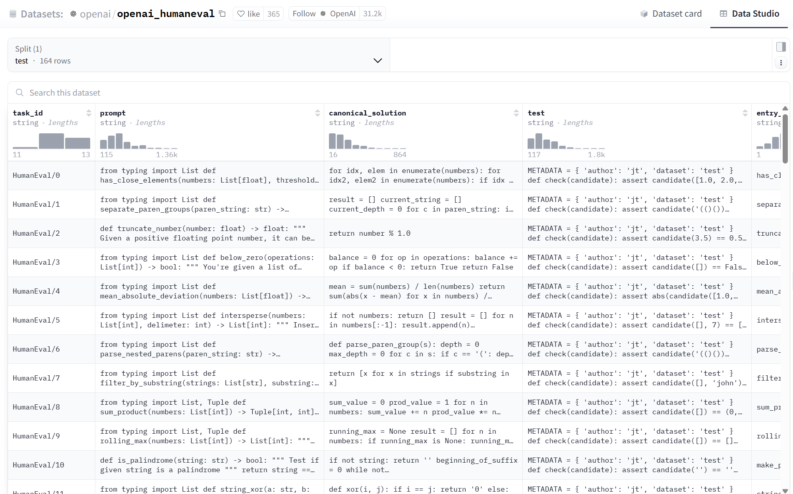
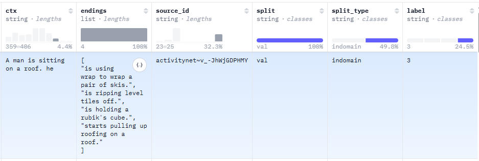
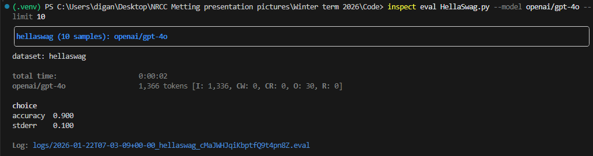
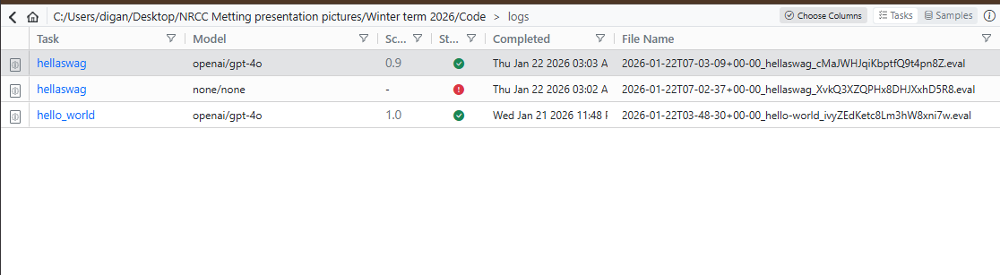
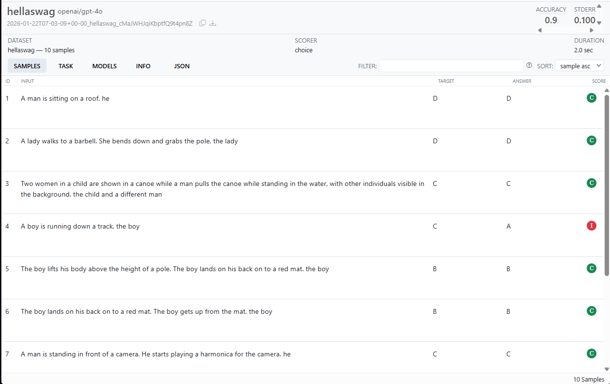
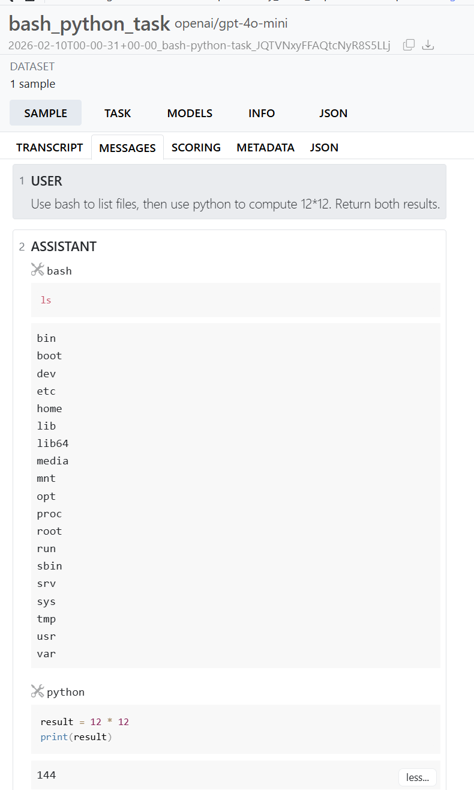

# What is Inspect


**Inspect** is an **open-source framework for evaluating Large Language Models (LLMs).** 

Think of Inspect as a workshop where you build “tests” for language models. Inspect gives you a *repeatable pipeline*: data goes in, the model does something structured, and you score what happened — with logs you can inspect later.

It is designed to support:  

- Model benchmarking
- Agent evaluations
- Reasoning and knowledge tests
- Tool-using and multi-modal evaluations

Inspect supports models from:

- OpenAI
- Anthropic
- Google
- Grok
- Mistral
- Hugging Face
- AWS Bedrock, Azure AI, Together, Groq, Cloudflare
- Local models (vLLM, Ollama, llama-cpp, Transformers)

# Installing Inspect

Install Inspect using pip:

```python
pip install inspect-ai
```
# Core Components of Inspect


Inspect evaluations are built from three **core components**.

# 1. Dataset

Datasets are collections of labeled samples. Each sample usually contains:

- **`Input`**: The task description
- `Target`: Expected output.  It can be either values or grading guidance.

The output your model produces, is later on compared to the **target** value, to grade the model**.** 

Inspect has native support for reading datasets in the `CSV`, `JSON`, and `JSON Lines` formats, as well as from `HuggingFace`. 

# 2. Solvers

The LLM/AI Agent/ RL Agent/ ML-Dl algorithm/ A function written by you will act as the solver. Basically, the thing you want to benchmark will act as solver. 

Solvers are the heart of Inspect evaluations and can serve a wide variety of purposes, including:

- Providing system prompts
- Prompt engineering
- Model generation
- Self critique
- Running an agent scaffold

# 3. Scorers

Scorers evaluate the final output of solvers. . They can use: 

- Exact matching: The output produced by your model has to be exactly the same as **target** value in dataset.
- Model-based grading: LLM  can be used as solvers.

# Tasks

A task consists of these 3 components.  Tasks provide a recipe for an evaluation ,consisting  of a dataset, a solver, and a scorer 

Tasks are created using the `@task` decorator so Inspect can discover them automatically.


# Setting LLM API


Lets Set Up our API first 

For OpenAI

```python
pip install openai
export OPENAI_API_KEY=your-openai-api-key
```

For Anthropic

```python
pip install anthropic
export ANTHROPIC_API_KEY=your-anthropic-api-key
```

For Google

```python
pip install google-genai
export GOOGLE_API_KEY=your-google-api-key
```

For Grok 

```python
pip install openai
export GROK_API_KEY=your-grok-api-key
```

Hugging Face

```python
pip install torch transformers
export HF_TOKEN=your-hf-token
```

If you are using Windows instead of export use **`set`**

```python
set OPENAI_API_KEY=your_api_key
```


# Hello World of Inspect Eval


An Inspect evaluation is like a small pipeline:

1. You provide a dataset
2. **A solver runs** on each test case
3. **A scorer grades** the solver’s output against the expected target
4. Inspect saves **logs** so you can inspect what happened later.

```python
from inspect_ai import Task, task
from inspect_ai.dataset import Sample
from inspect_ai.scorer import exact
from inspect_ai.solver import generate
```

- `Task`  : This defines everything about an evaluation. This is like a container that binds together:
    - What data to run on
    - How to call the solver(model)
    - How to grade the outputs.
- `task` :  When we try to run an evaluation, Inspect scans the file and finds functions decorated with `@task`. That’s how Inspect knows: “this function defines an evaluation I can run”.
- `Sample` :  one row / one test case in your dataset.
- `generate()` : Simplest solver.  It means: “send `input` to the model and return the model’s output.”
- `exact()` : This is a scorer. The model output must match `target` value.

```python
from inspect_ai import Task, task
from inspect_ai.dataset import Sample
from inspect_ai.scorer import exact
from inspect_ai.solver import generate

@task
def hello_world():
    return Task(
        dataset=[
            Sample(
                input="Just reply with Hello World",
                target="Hello World",
            )
        ],
        solver=[generate()],
        scorer=exact(),
    )
```

To run any eval file we will need to execute the following command: 

 

```python
inspect eval file_name -- model model_name
```

Lets try to run the file. 

```python
# always remember to setup API key. 
#in cmd we will use the command set 
set OPENAI_API_KEY="Your API KEY" 

# if you created a virtual environment, then : 
$Env: OPENAI_API_KEY="Your API Key"

# Now we will try to run the inspect eval file 
inspect eval HelloWorld.py --model openai/gpt-4o
```



Output

As you can see,  inspect eval will also create a log file.

# View Log

To see the log we need to run the following command: 

```python
inspect view start
```




# Options- logging, tuning, diagnostics, model


# Inspect Options

Inspect divides options into **two categories:** 

1. Durable, session-wide settings:  This refers to the type of settings we would like to keep same for all experiments. Some examples are:  
    1. API keys
    2. default model
    3. retry limits
    4. log directory
2. Per-run tuning:  These are things you change *per experiment*:
    1. run only 10 samples
    2. test a different solver
    3. limited runtime
    4. model temperature setting, etc. 

## How Options Are Specified

Inspect options can be set in **three different ways:** 

| .env file | Command Line |  Python **eval()** |
| --- | --- | --- |
| `INSPECT_EVAL_MODEL` | `--model` | `model` |
| `INSPECT_EVAL_LIMIT` | `--limit` | `limit` |
| `INSPECT_EVAL_TEMPERATURE` | `--temperature` | `temperature` |

## .env files

While we can include all required options on the `inspect eval` command line, it’s generally easier to use environment variables for commonly repeated options. The `inspect` CLI will automatically read and process `.env` files located in the current working directory (also searching in parent directories if a `.env` file is not found in the working directory).

```python
OPENAI_API_KEY=your-api-key
ANTHROPIC_API_KEY=your-api-key
GOOGLE_API_KEY=your-api-key

INSPECT_LOG_DIR=./logs-04-07-2024
INSPECT_LOG_LEVEL=warning

INSPECT_EVAL_MAX_RETRIES=5
INSPECT_EVAL_MAX_CONNECTIONS=20
INSPECT_EVAL_MODEL=anthropic/claude-3-5-sonnet-20240620
```

[More types of options or information can be found here](https://inspect.aisi.org.uk/options.html)


# Inspect Logs

Every evaluation produces **structured logs** that record:

- the full prompt sent to the model
- the model’s response
- intermediate tool calls
- scoring decisions
- explanations
- metadata
- timing and token usage

### Seeing log

Inspect provides a standalone web viewer. To access the logs: 

```python
inspect view 
# you can also run the command - inspect view start
```

Starts a local web server (default port 7575), Automatically loads logs from the configured log directory

# Tasks


## What is a Task?

A **task** defines **what you want to evaluate** and **how to evaluate it**.

At a minimum, a task includes:

- **Dataset** – the data or questions the model will be tested on
- **Solver** – how the model generates answers
- **Scorer** – how the answers are checked and scored

Tasks provide a recipe for an evaluation consisting minimally of a dataset, a solver, and a scorer (and possibly other options) and is returned from a function decorated with `@task`. For example:

```python
from inspect_ai import Task, task
from inspect_ai.dataset import json_dataset
from inspect_ai.scorer import model_graded_fact
from inspect_ai.solver import chain_of_thought, generate

@task
def security_guide():
    return Task(
        dataset=json_dataset("security_guide.json"),
        solver=generate(),
        scorer=model_graded_fact()
    )
```

# Task Options

Task parameters make it easy to run variants of your task without changing its source code. Task parameters are simply the arguments to your `@task` decorated function.

| Option | Description | Docs |
| --- | --- | --- |
| `epochs` | Epochs to run for each dataset sample. | [Epochs](https://inspect.aisi.org.uk/scorers.html#reducing-epochs) |
| `setup` | Setup solver(s) to run prior to the main solver. | [Sample Setup](https://inspect.aisi.org.uk/tasks.html#setup-parameter) |
| `cleanup` | Cleanup function to call at task completion | [Task Cleanup](https://inspect.aisi.org.uk/tasks.html#task-cleanup) |
| `sandbox` | Sandbox configuration for un-trusted code execution. | [Sandboxing](https://inspect.aisi.org.uk/sandboxing.html) |
| `approval` | Approval policy for tool calls. | [Tool Approval](https://inspect.aisi.org.uk/approval.html) |
| `metrics` | Metrics to use in place of scorer metrics. | [Scoring Metrics](https://inspect.aisi.org.uk/scorers.html#scoring-metrics) |
| `model` | Model for evaluation (note that model is typically specified by `eval` rather than in the task) | [Models](https://inspect.aisi.org.uk/models.html) |
| `config` | Config for model generation (also typically specified in `eval`). | [Generate Config](https://inspect.aisi.org.uk/options.html#model-generation) |
| `fail_on_error` | Failure tolerance for samples. | [Sample Failure](https://inspect.aisi.org.uk/errors-and-limits.html#failure-threshold) |
| `message_limittoken_limittime_limitworking_limit` | Limits to apply to sample execution. | [Sample Limits](https://inspect.aisi.org.uk/errors-and-limits.html#sample-limits) |
| `nameversionmetadata` | Eval log attributes for task. | [Eval Logs](https://inspect.aisi.org.uk/eval-logs.html) |

Examples: 

```python

from inspect_ai.solver import  system_message
from inspect_ai.agent import react
from inspect_ai.dataset._dataset import Sample
from inspect_ai.scorer import includes
from inspect_ai.solver import chain, generate, solver, use_tools
from inspect_ai.tool import bash, python

@solver
def ctf_tool_loop():
    return chain([
        use_tools([
            bash(timeout=180), 
            python(timeout=180)
        ]),
        generate()
    ])

@solver
def ctf_agent(attempts: int = 3):
    return react(
        tools=[bash(timeout=180), python(timeout=180)],
        attempts=attempts,
    )
@task
def ctf(
    system="devops.txt", 
):
      # return task
    return Task(
        dataset=read_dataset(),
        solver=[system_message(system), ctf_tool_loop()],
        sandbox="docker",
        scorer=includes(),
    )
   )
```

Now we can switch between solvers or pass other parrameters as well without changing the code 

```python
# run with the default solver (ctf_tool_loop)
inspect eval ctf.py

# run with the ctf agent solver
inspect eval ctf.py --solver=ctf_agent

# run with a different number of attempts
inspect eval ctf.py --solver=ctf_agent -S attempts=5
```

# Task Reuse

Task Reuse with `task_with()`

Task reuse allows you to **build new evaluation tasks from existing ones** instead of writing everything from scratch.

This is useful when:

- You want to experiment with different solvers
- You want to change sandbox environments
- You want to add limits or configuration
- You do not own or cannot modify the original task


# Dataset


## What is a Dataset in Inspect?

In Inspect, a **dataset** is just a collection of **samples**.

Each **sample** usually contains:

- an **input** (what we give to the model)
- an optional **target** (the expected or correct answer)
- optional **metadata** (extra info like difficulty, category, etc.)

## The `Sample` Object (Core Concept)

Internally, Inspect represents each row of data as a `Sample`.

### Key fields in a Sample

| Field | What it means |
| --- | --- |
| `input` | The prompt sent to the model |
| `target` | The expected answer  |
| `choices` | Multiple‑choice options (optional) |
| `id` | Unique identifier for the sample |
| `metadata` | Extra information about the sample |
| `files` | Files copied into the sandbox |
| `setup` | Script to run before evaluation |

You usually **don’t create `Sample` objects manually** — Inspect does it for you when loading datasets.

## Loading Simple Datasets

Inspect supports multiple formats:

- CSV
- JSON
- JSONL
- Hugging Face datasets

## Load a CSV dataset

```python
from inspect_ai.dataset import csv_dataset
dataset = csv_dataset("security_guide.csv")
```

## Loading a JSON Dataset

```python
from inspect_ai.dataset import json_dataset
dataset = json_dataset("dataset.json")
```

## Field Mapping (When Names Don’t Match)

Example Dataset: 

```python
{
"question": "What is SQL injection?",
"answer": "A database attack"
}
```

You can map them using `FieldSpec`:

```python
from inspect_ai.dataset import json_dataset, FieldSpec

dataset = json_dataset(
    "data.json",
    FieldSpec(
        input="question",
        target="answer"
    )
)
```

## Metadata (Extra Information)

Metadata is **read‑only information** attached to each sample.

Example uses:

- difficulty level
- category
- topic

```python
Sample(
    input="Explain XSS",
    target="Cross‑site scripting",
    metadata={"category": "security"}
)
```

Metadata is useful for:

- filtering datasets
- analyzing results later

## Filtering Datasets

You can filter samples easily:

```python
dataset = dataset.filter(
        lambda s: s.metadata.get("category") == "security"
)
```

## Loading Dataset from Huggingface

Typically datasets on Hugging Face will require specification of which split within the dataset to use (e.g. train, test, or validation) as well as some field mapping. Use the `hf_dataset()` function to read a dataset and specify the requisite split and field names:

```python
from inspect_ai.dataset import hf_dataset

from inspect_ai.dataset import FieldSpec, hf_dataset

dataset=hf_dataset("openai_humaneval", 
  split="test", 
  trust=True,
  sample_fields=FieldSpec(
    id="task_id",
    input="prompt",
    target="canonical_solution",
    metadata=["test", "entry_point"]
  )
)
```

Since this code is run on your local machine, you need to specify `trust = True` in order to perform the download.




# Loading Dataset from HuggingFace-Hellaswag

[HellaSwag](https://rowanzellers.com/hellaswag/) is a dataset designed to test commonsense natural language inference (NLI) about physical situations. We will Load  

Here is an example : 

```
In home pet groomers demonstrate how to groom a pet. the person

A.puts a setting engage on the pets tongue and leash.
B.starts at their butt rise, combing out the hair with a brush from a red.
C.is demonstrating how the dog’s hair is trimmed with electric shears at their grooming salon.
D.installs and interacts with a sleeping pet before moving away.
```



Hellaswag Dataset

Since inspect eval handles one `Task` at a time, and a `Task` can have only one sample , so we have to pass each sample one at a time 

```python
from inspect_ai import Task, task
from inspect_ai.dataset import Sample, hf_dataset
from inspect_ai.scorer import choice
from inspect_ai.solver import multiple_choice, system_message

def record_to_sample(record):
    return Sample(
        input=record["ctx"],
        target=chr(ord("A") + int(record["label"])),
        choices=record["endings"],
        metadata=dict(
            source_id=record["source_id"]
        )
    )
```

We’ll draw data from the validation split, and use the `record_to_sample()` function to parse the records (we’ll also pass `trust=True` to indicate that we are okay with locally executing the dataset loading code provided by hellaswag):

```python
SYSTEM_MESSAGE = """
Choose the most plausible continuation for the story.
"""
@task
def hellaswag():
   
    # dataset
    dataset = hf_dataset(
        path="hellaswag",
        split="validation",
        sample_fields=record_to_sample,
        trust=True
    )

    # define task
    return Task(
        dataset=dataset,
        solver=[
          system_message(SYSTEM_MESSAGE),
          multiple_choice()
        ],
        scorer=choice(),
    )
```

Since the LLM has to chose from multiple choices, we used the `multiple_choice()` solver . `multiple_choice()` calls `generate()` function internally, so we dont have to call it separately. 

We will only test with 10 data. 

```python
inspect eval HellaSwag.py --model openai/gpt-4o --limit 10
```



## To View Log in the browser

```python
inspect view start
```





# solvers


A **solver is a step-by-step plan** that tells Inspect:

- how to prepare prompts
- when to call the model
- how to handle responses
- whether to critique or retry
- how to move to the next step

A solver can be used for:

- Adding system or user prompts
- Prompt engineering (rewriting prompts)
- Calling the model to generate answers
- Running multiple model calls (multi-turn)
- Doing self-critique or refinement
- Running agent-style workflows

## Task and TaskState (Very Important)

Before understanding solvers, you need to know TaskState**.**

### What is TaskState?

`TaskState` stores everything about **one sample** during execution.

```python
class TaskState:
    messages: list[ChatMessage]  # conversation history
    output: ModelOutput          # final model output
```

## What is a Solver Function?

A solver is just an **async Python function** that:

1. Takes a `TaskState`
2. Optionally calls the model
3. Returns an updated `TaskState`

```python
from inspect_ai.solver import solver

@solver
def do_nothing():
    async def solve(state, generate):
        # We receive the current task state
        # We do not modify it
        # We do not call the model
        return state

    return solve

```

## Why Solvers Are `async`

Inspect runs **many samples in parallel** for speed.

So solvers must be async to:

- avoid blocking
- allow concurrency
- support multiple model calls

You don’t manage threads — Inspect does.

Some common fields : 

```python
state.messages       # conversation history
state.user_prompt    # first user message
state.output         # final model output
state.input_text     # original input text
state.target         # correct answer (if any)
```

## Built-in Solvers

Inspect already gives you many ready-made solvers.

### `system_message()`

Adds a **system prompt**.

```python
from inspect_ai.solver import system_message

system_message(
    "You are a helpful assistant who explains concepts clearly and simply."
)
```

`user_message()` 

```python
from inspect_ai.solver import user_message
user_message(
    "Explain recursion in simple terms."
)

```

### What this does

- Appends a user message to the conversation
- This is what the model will respond to

At this point, the conversation looks like:

```python
System: You are a helpful assistant...
User: Explain recursion in simple terms.
```

## Rewriting the Question for Better Answers

### `prompt_template()`

Before letting the model answer, we can **improve how the question is presented**.

This is called **prompt engineering**.

### Why use `prompt_template()` ?

We can use this to apply prompt engineering to the inputs from dataset.

### Code

```python
from inspect_ai.solverimport prompt_template
prompt_template("Answer clearly and concisely:\n\n{prompt}"
)
```

### What `{prompt}` means

- `{prompt}` is replaced with the original user input
- Inspect does this automatically

So now the model actually sees:

```
Answer clearly and concisely:

Explain recursion in simple terms
```

## calling the model

### `generate()`

This is the **only solver that actually calls the LLM**.

```python
from inspect_ai.solverimport generate
generate()
```

### What happens internally?

When `generate()` runs, Inspect:

1. Collects all messages so far
2. Sends them to the model
3. Receives the assistant’s response
4. Appends it to the conversation
5. Stores it as the task’s output

Now the conversation becomes:

```
System: You are a helpful assistant...
User: Answer clearly and concisely: 
			
			Explain recursion in simple terms.
Assistant: (model answer here)
```

## Self Reflection

### `self_critique()`

What if the first answer isn’t great?

Instead of accepting it blindly, we ask the model to **judge itself**.

That’s what `self_critique()` does.

### Code

```python
from inspect_ai import task
from inspect_ai.dataset import json_dataset
from inspect_ai.scorer import model_graded_fact

@task
def theory_of_mind():
    return Task(
        dataset=json_dataset("theory_of_mind.json"),
        solver=[
            system_message(
                "You are a careful and logical reasoner."
            ),
            prompt_template("{prompt}"),
            generate(),
            self_critique() # self critique
        ],
        scorer=model_graded_fact()
    )

```

### What happens behind the scenes?

1. The model critiques its own answer
2. The critique is added as a new message
3. The model generates a **better version**

All automatically.

## Writing Your First Custom Solver

Let’s gently modify the user prompt.

```python
from inspect_ai.solverimport solver
@solver
def add_prefix():
    async def solve(state, generate):
        # Take the original user question
        original_text = state.user_prompt.text

        # Add a helpful instruction
        state.user_prompt.text = (
            "Answer in very simple language:\n\n"
            + original_text
        )

        # Return the updated state
        return state

    return solve

```

## Multi-Turn Solver ()

```python
@solver
def ask_then_refine():
    async def solve(state, generate):
        # First answer
        await generate(state)

        # Add a follow-up instruction
        state.messages.append(
            ChatMessageUser(
                content="Now improve the answer and be more precise."
            )
        )

        # Second answer
        await generate(state)

        return state

    return solve

```

# Scorer


## What Is a Scorer?

A **Scorer** is a function that:

- Looks at the **model’s output**
- Compares it with the **expected answer (target)**
- Produces a **Score**

In simple terms:

```
Model Output + Expected Answer → Scorer → Score
```

### What can a scorer do?

A scorer can:

- Check if a word appears in the output
- Compare answers exactly
- Use regex
- Ask another model to judge the answer
- Or even run custom Python logic

## Built-in Scorers

Inspect AI already gives you many built-in scorers so you don’t start from scratch.

### Common Built-in Scorers

| Scorer | What it does |
| --- | --- |
| `includes()` | Checks if the target appears anywhere |
| `match()` | Checks beginning or end of output |
| `exact()` | Exact text match |
| `pattern()` | Uses regex |
| `f1()` | Measures partial correctness |
| `model_graded_qa()` | Uses another model to grade |

### Example: Checking if the answer contains a word

```python
from inspect_ai.scorerimport includes

task = Task(
    dataset=dataset,
    solver=solver,
    scorer=includes()
)
```

## Metrics — How Scores Become Numbers

Scores alone are not enough.

Inspect AI converts them into **metrics** like:

- **accuracy** → % correct
- **mean** → average score
- **stderr** → confidence estimate

### Example: Accuracy metric

```python
from inspect_ai.scorer import accuracy

@scorer(metrics=[accuracy()])
def my_scorer():
    ...

```

---

## Custom Scorers — Writing Your Own Judge

Now comes the powerful part.

A **custom scorer** is just an async function that:

- Receives model output (`TaskState`)
- Receives expected answer (`Target`)
- Returns a `Score`

### Minimal Custom Scorer

```python
from inspect_ai.scorer import Score

async def score(state, target):
    if target.text in state.output.completion:
        return Score(value="C")
    else:
        return Score(value="I")

```

## Using Models to Grade Models

Sometimes answers are:

- Long
- Ambiguous
- Hard to match exactly

Inspect AI solves this with **model-graded scorers**.

### Example: Model-graded QA

```python
from inspect_ai.scorerimport model_graded_qa

scorer = model_graded_qa(
    model="gpt-4",
    instructions="Grade the answer as correct or incorrect."
)
```

Here:

- One model answers
- Another model judges

There are also other perameters you can pass onto the `model_graded_qa`() function 

```python
@scorer(metrics=[accuracy(), stderr()])
def model_graded_qa(
    template: str | None = None,
    instructions: str | None = None,
    grade_pattern: str | None = None,
    include_history: bool | Callable[[TaskState], str] = False,
    partial_credit: bool = False,
    model: list[str | Model] | str | Model | None = None,
    model_role: str | None = "grader",
) -> Scorer:
    ...
```

## Multiple Models, Majority Voting

What if graders disagree?

Inspect AI supports **multiple graders** and picks the majority.

```python
Task(
    dataset=dataset,
    solver=[
        system_message(SYSTEM_MESSAGE),
        generate()
    ],
    scorer=[
        model_graded_qa(model="openai/gpt-4"), 
        model_graded_qa(model="google/gemini-2.5-pro")
    ],
)
```

 Final score = **majority vote**

## Everything Put Together

### Full Example

```python
from inspect_ai import Task
from inspect_ai.dataset import Sample
from inspect_ai.scorer import includes, accuracy
from inspect_ai.solver import generate

dataset = [
    Sample(
        input="What is the capital of France?",
        target="Paris"
    )
]

task = Task(
    dataset=dataset,
    solver=generate(),
    scorer=includes(),
    metrics=[accuracy()]
)

```

###

# Tool Usage for LLM


# Tool Use

Tools are Python functions that you provide for the model to call for assistance with various tasks 

## Example- Addition Tool

We’ll demonstrate with a simple tool that adds two numbers, using the `@tool` decorator to register it with the system:

```python
from inspect_ai import Task, task
from inspect_ai.dataset import Sample
from inspect_ai.scorer import match
from inspect_ai.solver import (
    generate, use_tools
)
from inspect_ai.tool import tool

@tool
def add():
    async def execute(x: int, y: int):
        """
        Add two numbers.

        Args:
            x: First number to add.
            y: Second number to add.

        Returns:
            The sum of the two numbers.
        """
        return x + y

    return execute
    

```

Now that we’ve defined the tool, we can use it in an evaluation by passing it to the [use_tools()](https://inspect.aisi.org.uk/reference/inspect_ai.solver.html#use_tools) function

```python
@task
def addition_problem():
    return Task(
        dataset=[Sample(
            input="What is 1 + 1?",
            target=["2", "2.0"]
        )],
        solver=[use_tools(add()), generate()],
        scorer=match(numeric=True),
    )
```

# Standard Tools Provided by Inspect AI

| Tool | One-line description |
| --- | --- |
| **web_search** | Lets the model search the web and summarize results to get fresh or external information. |
| **bash** | Runs Linux shell commands in a sandboxed environment, with a fresh shell for each call. |
| **bash_session** | Runs Linux shell commands in a sandbox **with persistent state** across multiple calls. |
| **python** | Executes Python code locally inside a sandboxed environment (stateful per task). |
| **code_execution** | Executes Python code on the model provider’s server in a **stateless** environment. |
| **text_editor** | Allows the model to create, read, and edit text files inside a sandbox. |
| **web_browser** | Controls a headless Chromium browser to navigate pages, click elements, and submit forms. |
| **computer** | Gives the model a full virtual desktop with screen, mouse, and keyboard control. |
| **skill** | Loads reusable instructions and resources (skills) that the model can invoke when needed. |
| **memory** | Allows the model to store and retrieve information across steps or longer tasks. |
| **update_plan** | Helps the model track steps and progress for long-horizon tasks. |
| **think** | Adds an extra reasoning step before producing the final answer. |

So the basic template looks like this : 

```python
from inspect_ai import Task, task
from inspect_ai.dataset import Sample
from inspect_ai.solver import generate, use_tools

@task
def my_task():
    return Task(
        dataset=[Sample(input="...")],
        solver=[
            use_tools(...),  # tools go here
            generate()
        ],
    )

```

## Web Search Tool

There are 2 types of  providers :

### Free: “Internal” (built into model provider, usually no extra API key)

- `openai`, `anthropic`, `gemini`, `grok`, `perplexity`
    
    These typically work only with that provider’s models.
    

### Paid: “External” (you must bring your own API keys)

- `tavily`, `exa`, `google`

```python
@task
def web_search_task():
    return Task(
        dataset=[
            Sample(input="What is Inspect AI? Answer in 2–3 sentences.")
        ],
        solver=[
            use_tools(web_search("openai")),  # ✅ free (no Google key)
            generate()
        ]
    )
```

### bash and python

- `bash()` executes shell commands
- `python()` executes Python code
    
    Both require a **Sandbox Environment** (typically Docker), because it’s untrusted code execution. We will talk about integrating snadbox environment in the next chapter. 
    

```python
@task
def bash_python_task():
    return Task(
        dataset=[
            Sample(input="Use bash to list files, then use python to compute 12*12. Return both results.")
        ],
        solver=[
            use_tools(
                bash(timeout=CMD_TIMEOUT),
                python(timeout=CMD_TIMEOUT),
            ),
            generate()
        ],
        sandbox="docker"  # ✅ required
    )
```

If you inspect the logs after running this code file, you will see something similar to this: 



# bash_session — “A bash shell that remembers state”

Unlike `bash()` (fresh environment each call), `bash_session()` keeps:

- working directory
- environment variables
- state across tool calls

```python
@task
def bash_session_task():
    return Task(
        dataset=[
            Sample(input="Create a file hello.txt using bash, then print it. (Use one session.)")
        ],
        solver=[
            use_tools(bash_session(timeout=180)),
            generate()
        ],
        sandbox="docker"
    )
```

# skill — “Reusable tool instructions (skills folder)”

A **skill** is a folder of instructions/scripts/resources that the agent can discover and use.

```python
SKILLS_DIR = Path(__file__).parent / "skills"

@task
def skill_task():
    return Task(
        dataset=[Sample(input="Use the available skills to gather system info, then summarize.")],
        solver=[
            use_tools(
                skill([
                    SKILLS_DIR / "system-info",
                    SKILLS_DIR / "network-info",
                ])
            ),
            generate()
        ],
        sandbox="docker"
    )
```

### One Final Example:  Web search —> write a report —> verifying it.

- Use **web_search** (free: OpenAI internal)
- Use **text_editor** to write a report file
- Use **bash_session** to display/verify the file

```python
from inspect_ai import Task, task
from inspect_ai.dataset import Sample
from inspect_ai.solver import generate, use_tools
from inspect_ai.tool import web_search, text_editor, bash_session

@task
def research_report_task():
    return Task(
        dataset=[
            Sample(input=(
                "1) Use web search to learn what Inspect AI is.\n"
                "2) Write a short report into report.txt (5-8 lines).\n"
                "3) Use bash to print report.txt.\n"
                "Return the printed report content."
            ))
        ],
        solver=[
            use_tools(
                web_search("openai"),          # free (for openai models)
                text_editor(timeout=180),      # needs sandbox
                bash_session(timeout=180)      # needs sandbox
            ),
            generate()
        ],
        sandbox="docker"
    )

```

To check the logs, just run the command: 

```python
inspect view start
```

# Sandboxing


# Sandboxing in Inspect Eval

When we evaluate large language models, we often want them to:

- run shell commands (`ls`, `pwd`, `python script.py`)
- create files
- execute untrusted or generated code
- interact with tools safely

But **we never want a model to do these things on our real machine**.

That’s where **sandboxing** comes in.

> **A sandbox is an isolated environment where code can run safely, without affecting your system.**
> 

Inspect Eval uses **Docker-based sandboxes** to achieve this.

## The Core Idea of Sandboxing in Inspect Eval

The sandbox defines:

- what OS exists
- what software is installed
- whether networking is allowed
- what files are accessible

## Where the Sandbox Is Defined: `compose.yaml`

The sandbox environment is described using a **Docker Compose file**.

This file tells Inspect Eval:

> “Create a container that looks like *this*, and run all tools inside it.”
> 

### Example: `compose.yaml`

```yaml
services:
  default:
    image: python:3.12-bookworm
    init: true
    command: ["tail", "-f", "/dev/null"]
    network_mode: "none"
```

### 

### `services.default`

- Inspect looks for a service named `default`
- This is the **main sandbox container**

### `image: python:3.12-bookworm`

- This defines the **operating system and installed software**
- Linux + Python 3.12 is available
- Anything not installed here **does not exist**

### `command: ["tail", "-f", "/dev/null"]`

- Keeps the container running
- Allows Inspect to execute commands inside it later

### `network_mode: "none"`

- Disables internet access
- Makes evaluation safer and reproducible

> The model cannot access the web unless you explicitly allow it.
> 

## How Inspect Eval Uses This Sandbox

When you run:

```bash
python -m inspect_ai eval my_task.py
```

Inspect does the following:

1. Reads your task file
2. Sees `sandbox=("docker", "compose.yaml")`
3. Starts a Docker container using `compose.yaml`
4. Executes **all tools inside that container**
5. Collects logs, outputs, and results
6. Destroys the container (unless told otherwise)

## Tools: How Models Interact with the Sandbox

Models **cannot directly run code**.

They must use **tools**.

The most important sandbox tools are:

- `bash` → run a single shell command
- `bash_session` → run multiple commands in the same shell session

## Writing an Inspect Eval Task

Now let’s write a **complete task** that uses:

- a Docker sandbox
- `bash`
- `bash_session`

## Full Example: Sandbox + Tools + Task

### File structure

```
sandbox_demo/
│
├── compose.yaml
└── sandbox_tools_demo.py
```

## `compose.yaml` (Sandbox Definition)

```yaml
services:
  default:
    image: python:3.12-bookworm
    init: true
    command: ["tail", "-f", "/dev/null"]
    network_mode: "none"
```

This defines the **world** the model will live in.

## `sandbox_tools_demo.py` (Inspect Task)

```python
from inspect_ai import Task, task
from inspect_ai.dataset import Sample
from inspect_ai.scorer import match
from inspect_ai.solver import generate, system_message, use_tools
from inspect_ai.tool import bash, bash_session

@task
def sandboxing_demo():
    """
    Beginner-friendly demonstration of sandboxing in Inspect Eval.
    """

    dataset = [
        Sample(
            input=(
                "Part 1: Use the bash tool.\n"
                "Run the following commands:\n"
                "1) uname -a\n"
                "2) python --version\n"
                "Return both outputs."
            )
        ),
        Sample(
            input=(
                "Part 2: Use bash_session.\n"
                "Run these steps one by one:\n"
                "1) mkdir -p work\n"
                "2) cd work\n"
                "3) echo 'Hello from the sandbox' > hello.txt\n"
                "4) pwd\n"
                "5) cat hello.txt\n"
                "Return the final two outputs."
            ),
            target="Hello from the sandbox"
        ),
    ]

    return Task(
        dataset=dataset,
        solver=[
            system_message(
                "You must use tools. "
                "Use bash for Part 1 and bash_session for Part 2. "
                "Do not guess outputs."
            ),
            use_tools([
                bash(timeout=60),
                bash_session(timeout=120),
            ]),
            generate(),
        ],
        scorer=match(),
        sandbox=("docker", "compose.yaml"),
        message_limit=40,
    )
```

## How This Task Executes (Step-by-Step Workflow)

### Step 1: Task starts

Inspect reads:

```python
sandbox=("docker", "compose.yaml")
```

### Step 2: Docker container starts

Inspect runs:

```bash
docker compose up
```

### Step 3: Sample 1 runs

- Model reads instructions
- Model calls `bash("uname -a")`
- Inspect executes inside container
- Output returned to model

### Step 4: Sample 2 runs

- Model opens `bash_session`
- Commands execute in sequence
- Files persist
- Working directory persists

### Step 5: Scoring

- Sample 1 → informational (no target)
- Sample 2 → checked against target

### Step 6: Cleanup

- Container is destroyed
- Logs are saved

### 

# Using Agent


# Using Agents in Inspect Eval

## What Is an Agent?

Agents are ideal for **complex, multi-step problems**, such as:

- Capture the Flag (CTF)
- Web research
- Debugging code
- Software engineering tasks

## How Inspect Uses Agents

Inspect Eval supports multiple ways of working with agents:

1. **Built-in ReAct Agent** (recommended starting point)
2. **Custom Agents** (full control)
3. **Multi-Agent Systems** (agents working together)
4. **External Agent Frameworks** (via Agent Bridge)
5. **Human Agent** (humans solving tasks for baseline comparison)

This section focuses on **how agents work in general**.

## Agent Basics: The Protocol

In Inspect:

- An agent is a function marked with `@agent`
- It receives an **AgentState**
- It returns an updated **AgentState**

The state contains:

- Conversation history
- Tool outputs
- Final result

## Example 1: A Simple Custom Agent (Web Researcher)

We want an agent that:

- Searches the web
- Reads results
- Answers questions

### Code Example (Manual Agent)

```python
from inspect_ai.agent import Agent, AgentState, agent
from inspect_ai.model import ChatMessageSystem, get_model
from inspect_ai.tool import web_search

@agent
def web_surfer() -> Agent:
    async def execute(state: AgentState) -> AgentState:
        # Give the agent instructions
        state.messages.append(
            ChatMessageSystem(
                content="You are an expert at using a web browser to answer questions."
            )
        )

        # Run the model in a tool loop
        messages, output = await get_model().generate_loop(
            state.messages,
            tools=[web_search()]
        )

        # Update state
        state.output = output
        state.messages.extend(messages)
        return state

    return execute

```

### What’s Happening?

- **You call the agent** with an initial user question.
- The agent pushes a **system “role” instruction** into `state.messages`.
- `generate_loop()` starts:
    - The model responds and may call tools (like `web_search()`).
    - Inspect executes the tool call(s) and appends tool results as messages.
    - The model sees those results and continues.
- Eventually the model stops calling tools and returns a final response.
- The agent stores everything back into `AgentState` and returns it.

## Same Agent Using the ReAct Agent

Here’s the same web researcher using `react()`:

```python
from inspect_ai.agent import Agent, agent, react
from inspect_ai.tool import web_search

@agent
def web_surfer() -> Agent:
    return react(
        name="web_surfer",
        description="Web research assistant",
        prompt="You are an expert at using a web browser to answer questions.",
        tools=[web_search()]
    )

```

We will get into more details about ReAct agent in another chapter. 

## Using Agents in Inspect

There are several ways to use agents in Inspect, these are the common patterns

### Run an agent directly with `run()`

```python
from inspect_ai.agent import run

state = await run(web_surfer(), "What were the 3 most popular movies of 2020?")
print(state.output.completion)
```

This executes the agent directly and gives you the final `AgentState` 

### Use an agent as the `solver` in a `Task`

```python
Task(
    dataset=dataset[Sample(
            input="What were the 3 most popular movies of 2020??",
        )],
    solver=web_surfer(), # we are using the same ReAct based web_surfer agent.
    scorer=includes()
)
```

- For each sample:
    - It creates a fresh state (messages include the sample prompt).
    - Runs your agent as the solver.
- The agent runs its tool loop and ends with `submit()`.
- The task’s `scorer` evaluates the submission.
- Inspect logs everything: messages, tool calls, score, etc

### Use an Agent as a Tool

An agent can be wrapped as a **tool** and used by another model.

```python
from textwrap import dedent

from inspect_ai import Task, task
from inspect_ai.dataset import Dataset, Sample
from inspect_ai.scorer import includes
from inspect_ai.solver import use_tools, generate

from inspect_ai.agent import agent, react, as_tool
from inspect_ai.tool import web_search

# -----------------------------
# 1) Build an Agent 
# -----------------------------
@agent
def web_surfer():
    #  the same react style agent we created earlier

# ------------------------------------------
# 2) Wrap that Agent so it can be used as a Tool
# ------------------------------------------
research_tool = as_tool(web_surfer())

# -----------------------------
# 3) Create a Task (the eval)
# -----------------------------
@task
def research_with_agent_tool():

    solver = [
        use_tools(research_tool),
        generate(),
    ]

    return Task(
        dataset=[
            Sample(
                input="what is the highest rated restaurant in tokyo japan?",
                target="Den",
            ),
            Sample(
                input="What is the highest rated movie in IMDB from 2023?",
                target="Spider-Man: Across the Spider-Verse",
            ),
        ],
        solver=solver,
        scorer=includes(),  # checks if target text appears in final answer
    )

```

Here:

- The main model can *call the agent*
- The agent returns text output

### Multi-Agent Systems (Handoff)

Agents can collaborate by **sharing conversation history**.

```python
solver=[
        use_tools(addition(), handoff(web_surfer())),
        generate()
    ]

```

### `handoff()` vs `as_tool()`

| Feature | `as_tool()` | `handoff()` |
| --- | --- | --- |
| Shared conversation | ❌ No | ✅ Yes |
| Agent can add messages | ❌ No | ✅ Yes |
| Best for | Simple calls | Teamwork |

##

# ReAct Agent


# ReAct Agent (Beginner Documentation)

## What is a ReAct Agent?

A **ReAct agent** is an agent that can:

- **Think** (reason about the problem)
- **Act** (use tools like bash, files, editors)
- **Repeat** until it finishes the task

In Inspect Eval, the `react()` agent is the **default and baseline agent**.

## How the ReAct Agent Works (Big Picture)

what happens when a ReAct agent runs:

1. The model reads the task
2. It reasons about what to do next
3. It calls a tool 
4. It looks at the tool output
5. It repeats steps 2–4
6. When finished, it calls **`submit()`**

The loop only ends when the agent **explicitly submits an answer**.

## Built-in Capabilities of `react()`

The ReAct agent comes with useful features out of the box:

### Tool Loop

- Keeps running until `submit()` is called
- If the model forgets to submit, it is encouraged to continue

### Multiple Attempts

- If the answer is wrong, the agent can try again
- Uses the task’s scorer to check correctness
- Default: **1 attempt**

### Context Compaction

- Automatically shortens conversation history
- Helps avoid context window overflow
- Useful for long-running tasks

## Simple  Example: CTF Agent

Imagine you want an agent that solves **Capture-the-Flag (CTF)** challenges.

The agent:

- Logs into a Linux machine
- Runs commands
- Edits files
- Finds a flag
- Submits it

### Step 1: Define the Agent

```python
from textwrap import dedent
from inspect_ai.agent import Agent, agent, react
from inspect_ai.tool import bash_session, text_editor

@agent
def ctf_agent(attempts=3) -> Agent:
    PROMPT = dedent("""
    You are a Capture the Flag (CTF) player.
    Your goal is to find flags formatted as picoCTF{...}.
    """)

    return react(
        description="Expert at cybersecurity challenges",
        prompt=PROMPT,
        tools=[bash_session(), text_editor()],
        attempts=attempts, # how many times the agent can retry if it failed the first time
    )

```

### What’s happening?

- `@agent` marks this as an agent definition
- `react()` creates the ReAct loop

## Using a ReAct Agent in a Task

```python
from inspect_ai import Task, task
from inspect_ai.dataset import json_dataset
from inspect_ai.scorer import includes

@task
def reAct_agetn_as_solver():

    return Task(
        dataset=json_dataset("ctf_challenge.json"),
        solver=ctf_agent(),
        scorer=includes(),  # checks if target text appears in final answer
        )
```

### Flow:

Dataset → ReAct Agent → Tool Usage → Submission → Scoring

## Prompts: How the Agent is Instructed

### Default Assistant Prompt

The agent is told:

- Think before acting
- Use tools when helpful
- Call `submit()` when done

### Customizing the Prompt

```python
from textwrap import dedent
from inspect_ai.agent import agent, react
from inspect_ai.tool import web_search

@agent
def react_researcher():
    PROMPT = dedent("""
    You are a careful research assistant.

    Rules:
    1) If the question needs factual info, call web_search first.
    2) Use the tool output as your source of truth.
    3) If the tool results don't contain the answer, say so.
    4) Keep the final answer short.
    5) When finished, call submit() with ONLY the final answer text.
    """)

    return react(
        name="react_researcher",
        description="ReAct agent with strong tool-use rules.",
        prompt=PROMPT,
        tools=[web_search()],
    )

```

---

## Attempts: Letting the Agent Retry

By default:

- Only **1 attempt**

To allow retries:

```python
react(
    ...
    attempts=3,
)

```

---

## Compaction: Managing Long Conversations

Long-running agents can exceed context limits. 

Eventually:

- the model hits context window limits
- performance drops
- it “forgets” early details

**Compaction** lets Inspect shrink older history while keeping important info.

```python
from inspect_ai.model import CompactionSummary
from inspect_ai.agent import agent, react
from inspect_ai.tool import web_search

@agent
def react_with_compaction():
    return react(
        name="react_with_compaction",
        description="Summarizes old messages when near context limit.",
        prompt="Use web_search for facts. Finish with submit().",
        tools=[web_search()],
        compaction=CompactionSummary(threshold=0.8),
    )

```

when the conversation is ~80% of the model’s context budget, compaction kicks in.

If your agent needs recent tool results but not every old detail, you can keep only a few recent tool interactions

```python
@agent
def react_keep_recent_tools():
    return react(
        name="react_keep_recent_tools",
        description="Keeps only recent tool calls, trims the rest.",
        prompt="Use tools when needed. Finish with submit().",
        tools=[web_search()],
        compaction=CompactionEdit(keep_tool_uses=3),
    )
```

## Handling Model Refusals

Sometimes models stop with a refusal. In these cases, you can ask the agent to automatically try again.

You can retry automatically:

```python
react(
    ...
    retry_refusals=3,
)

```

Retries happen when:

- stop_reason == `"content_filter"`
- The model generates output  and stops because of `content_filter`   
Inspect will re-run generation up to `retry_refusals` times

## Continuation: When the Agent Gets Stuck

Sometimes the agent:

- Stops calling tools
- Talks about submitting but doesn’t

Inspect Eval fixes this using **continuation messages**.

### Default Behavior

If no tool is called, the agent is prompted:

> “Please proceed or call submit() if done.”
> 

---

### Custom Continuation

```python
react(
    ...
    on_continue="Please continue solving or submit your answer."
)

```

---

## The `submit()` Tool

The ReAct agent uses a special **submit tool** to signal completion.

### Why this is important:

- Prevents accidental early termination
- Enables multiple attempts
- Makes success/failure explicit

### Disabling `submit()`

```python
react(
    ...
    submit=False
)

```

If disabled:

- The agent stops when it stops calling tools
- You must control termination manually
- Use only when you have another stopping mechanism .
